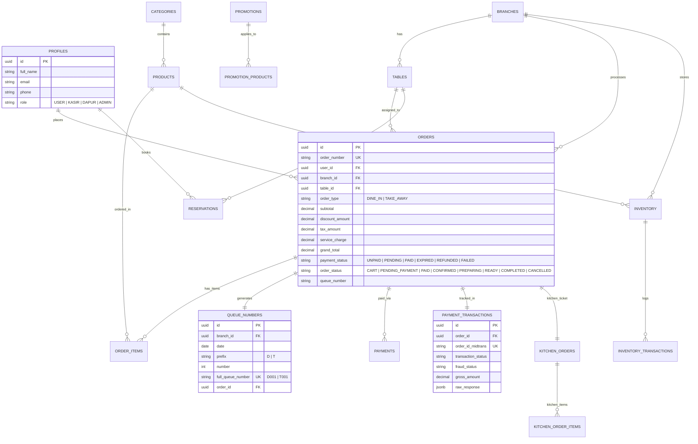

# Entity Relationship Diagram (ERD) & Database Specification
## Sistem Manajemen Kafe & POS - Mie Gacoan

---

## 1. Diagram Hubungan Entitas (Mermaid ERD)

---

## 2. Rincian 20 Tabel Master Database

| No | Nama Tabel | Deskripsi Ringkas | Kebijakan Akses Utama (RLS) |
| :--- | :--- | :--- | :--- |
| 1 | `profiles` | Data identitas & peran pengguna | User baca milik sendiri; Admin baca/ubah semua |
| 2 | `branches` | Data cabang restoran | Publik baca cabang aktif; Admin kelola penuh |
| 3 | `tables` | Data meja makan & kapasitas | Publik baca ketersediaan; Kasir/Admin kelola status |
| 4 | `categories` | Kategori menu makanan/minuman | Publik baca kategori aktif; Admin kelola penuh |
| 5 | `products` | Katalog produk, harga & gambar | Publik baca produk aktif; Admin kelola penuh |
| 6 | `reservations` | Pemesanan meja makan mendatang | Pelanggan baca milik sendiri; Staf kelola penuh |
| 7 | `orders` | Struk transaksi pesanan | Pelanggan baca milik sendiri; Staf kelola operasional |
| 8 | `order_items` | Rincian produk per transaksi | Pelanggan baca item sendiri; Staf kelola |
| 9 | `queue_numbers` | Nomor antrean harian (`D001`/`T001`) | Publik baca; Sistem/Kasir buat otomatis |
| 10 | `payments` | Catatan metode bayar (`MIDTRANS`, `CASH`) | Pelanggan & Kasir baca/tambah |
| 11 | `payment_transactions` | Log webhook & payload Midtrans Snap | Terisolasi khusus Edge Function & Admin |
| 12 | `kitchen_orders` | Tiket antrean dapur | Staf Dapur, Kasir & Admin baca/update status |
| 13 | `kitchen_order_items` | Rincian item masakan dapur | Staf Dapur & Kasir baca/update |
| 14 | `promotions` | Kode promo & voucher diskon | Publik baca promo aktif; Admin kelola penuh |
| 15 | `promotion_products` | Pemetaan promo ke produk spesifik | Admin kelola |
| 16 | `inventory` | Stok barang per cabang | Kasir/Admin baca; Admin kelola penuh |
| 17 | `inventory_transactions` | Log barang masuk/keluar/rusak | Admin & Kasir tambah log |
| 18 | `notifications` | Notifikasi realtime per peran | Pengguna & Peran target baca |
| 19 | `audit_logs` | Log aktivitas sensitif sistem | Khusus Admin baca |
| 20 | `settings` | Pengaturan pajak, service & cabang | Publik baca; Admin kelola |
